# Uplift — Data Architecture Diagrams
**Group No. 13 — Descenders | ICT4153 Mobile Application Development | University of Ruhuna**
**Source of Truth:** `lib/database/database_helper.dart` (Schema v11), `lib/models/`, `lib/services/sync_service.dart`

---

## Diagram 1 — Full Relational Entity-Relationship Diagram

> **Scope:** All 9 tables present in the production SQLite schema (v11).
> Relationships are derived directly from `FOREIGN KEY` constraints in `database_helper.dart`.
> Data types map 1-to-1 with Dart model fields (`TEXT` = String, `REAL` = double, `INTEGER` = int/bool).
> `REMINDERS`, `FAVORITE_TIPS`, and `RECENT_TIPS` are device-local standalone tables (no `user_id` FK).

```mermaid
erDiagram

    %% ──────────────────────────────────────────────
    %% CORE USER-SCOPED TABLES
    %% ──────────────────────────────────────────────

    USERS {
        TEXT    id              PK  "Firebase UID (Primary Key)"
        TEXT    name
        TEXT    email
        TEXT    password            "SHA-256 hashed"
        TEXT    created_at          "ISO-8601 datetime string"
        INTEGER age
        TEXT    gender
        REAL    height              "cm (metric) or in (imperial)"
        REAL    weight              "kg (metric) or lbs (imperial)"
        TEXT    profile_picture     "Base64-encoded image string"
        TEXT    interests           "JSON array — e.g. [Fitness, Diet]"
        INTEGER is_dark_mode        "0 = Light, 1 = Dark (Theme persistence)"
        INTEGER sync_status         "0 = unsynced, 1 = synced to Firestore"
    }

    GOALS {
        INTEGER id              PK  "AUTOINCREMENT"
        TEXT    user_id         FK  "References USERS(id) ON DELETE CASCADE"
        TEXT    title
        TEXT    category            "e.g. Running, Diet, Water, Steps (Daily)"
        REAL    target_value
        REAL    current_value
        TEXT    unit                "e.g. km, ml, steps"
        TEXT    deadline            "ISO-8601 date string"
        TEXT    reminder_time       "e.g. 08:00 AM — nullable"
        INTEGER is_completed        "0 = active, 1 = completed"
        INTEGER sync_status         "0 = unsynced, 1 = synced"
    }

    ACTIVITIES {
        INTEGER id              PK  "AUTOINCREMENT"
        TEXT    user_id         FK  "References USERS(id) ON DELETE CASCADE"
        TEXT    type                "steps | walking | running | cycling | gym | yoga | swimming | custom"
        REAL    value               "Numeric magnitude (steps count, km, etc.)"
        TEXT    date                "yyyy-MM-dd string"
        INTEGER duration            "Duration in minutes"
        INTEGER sync_status         "0 = unsynced, 1 = synced"
    }

    HEALTH_LOGS {
        INTEGER id              PK  "AUTOINCREMENT"
        TEXT    user_id         FK  "References USERS(id) ON DELETE CASCADE"
        REAL    weight              "kg or lbs depending on unit"
        REAL    height              "cm or inches depending on unit"
        REAL    bmi                 "Auto-calculated: weight / (height_m ^ 2)"
        TEXT    date                "yyyy-MM-dd string"
        TEXT    tags                "CSV string — e.g. Post-Workout,Rest Day"
        TEXT    notes               "Free-text user note — nullable"
        TEXT    unit                "metric | imperial"
        REAL    waist               "nullable — cm or in"
        REAL    hip                 "nullable — cm or in"
        REAL    chest               "nullable — cm or in"
        REAL    body_fat            "nullable — percentage"
        INTEGER sync_status         "0 = unsynced, 1 = synced"
    }

    STEP_RECORDS {
        INTEGER id              PK  "AUTOINCREMENT"
        TEXT    user_id         FK  "References USERS(id) ON DELETE CASCADE"
        TEXT    date                "yyyy-MM-dd — one record per day"
        INTEGER step_count          "Total steps for that day"
        INTEGER goal                "Daily step target at time of recording"
    }

    WORKOUT_RECORDS {
        INTEGER id              PK  "AUTOINCREMENT"
        TEXT    user_id         FK  "References USERS(id) ON DELETE CASCADE"
        TEXT    workout_type        "Walking | Running | Cycling | Gym | Yoga | Swimming | Other"
        INTEGER duration_mins       "Session length in minutes"
        INTEGER calories_burned     "Estimated kcal"
        TEXT    logged_at           "ISO-8601 datetime string"
        TEXT    notes               "nullable"
    }

    %% ──────────────────────────────────────────────
    %% DEVICE-LOCAL STANDALONE TABLES (No user_id FK)
    %% These are not cloud-synced; they are per-device caches.
    %% ──────────────────────────────────────────────

    REMINDERS {
        INTEGER id              PK
        TEXT    title               "User-defined reminder title"
        TEXT    body                "Notification message body"
        TEXT    times               "JSON array of hour/minute maps"
        INTEGER is_enabled          "0 = off, 1 = on"
        TEXT    alert_style         "banner | alarm"
        TEXT    repeat_days         "7-char bitmask Mon–Sun e.g. 1111100"
        INTEGER vibration           "0 = off, 1 = on"
        TEXT    sound_name          "default | gentle | urgent | silent"
    }

    FAVORITE_TIPS {
        TEXT    topic_id        PK  "API Id from health.gov — avoids title collisions"
        TEXT    title
        TEXT    description
        TEXT    content             "Raw HTML content from API"
        TEXT    url                 "Link to accessible web version"
        TEXT    image_url           "nullable — health.gov relative path"
    }

    RECENT_TIPS {
        TEXT    topic_id        PK  "API Id from health.gov"
        TEXT    title
        TEXT    description
        TEXT    content             "Raw HTML content"
        TEXT    url
        INTEGER visited_at          "Epoch milliseconds — used for ordering & pruning to 20"
        TEXT    image_url           "nullable"
    }

    %% ──────────────────────────────────────────────
    %% RELATIONSHIPS
    %% One User → Many of each user-scoped table (ON DELETE CASCADE)
    %% Standalone tables have no FK relationships
    %% ──────────────────────────────────────────────

    USERS ||--o{ GOALS          : "sets (user_id FK)"
    USERS ||--o{ ACTIVITIES     : "logs (user_id FK)"
    USERS ||--o{ HEALTH_LOGS    : "records (user_id FK)"
    USERS ||--o{ STEP_RECORDS   : "tracks daily (user_id FK)"
    USERS ||--o{ WORKOUT_RECORDS : "sessions (user_id FK)"
```

---

## Diagram 2 — Dual-Database Offline-First Sync Architecture

> **Scope:** Complete write path (UI → SQLite) and bidirectional sync path (SQLite ↔ Firestore).
> Derived from `lib/services/sync_service.dart` — both `syncData()` (Local→Cloud) and `rehydrateData()` (Cloud→Local).
> The `sync_status` flag (`0 = unsynced, 1 = synced`) in `GOALS`, `ACTIVITIES`, and `HEALTH_LOGS`
> is the exact mechanism used to identify unsynced records before pushing them to Firestore.

```mermaid
graph TD
    %% ── Actors ────────────────────────────────────────────────────────────
    User(["👤 User"])
    Auth(["🔐 AuthService\n(Firebase Auth)"])

    %% ── Presentation Layer ────────────────────────────────────────────────
    subgraph PRESENTATION ["🖥️  Presentation Layer"]
        UI["Flutter UI Screens\n(GoalsScreen, ActivityScreen,\nHealthLogScreen, DashboardScreen)"]
        Provider["State Management\n(ActivityProvider / ChangeNotifiers)"]
    end

    %% ── Business / Domain Layer ────────────────────────────────────────────
    subgraph DOMAIN ["⚙️  Domain Layer"]
        GoalRepo["GoalRepository\ngetGoalsByUser() · upsertGoal()\ngetUnsyncedGoals() · updateSyncStatus()"]
        ActivityRepo["ActivityRepository\ngetActivitiesByUser() · upsertActivity()\ngetUnsyncedActivities()"]
        HealthRepo["HealthLogRepository\ngetLogsByUser() · upsertLog()\ngetUnsyncedLogs()"]
    end

    %% ── Local Persistence ─────────────────────────────────────────────────
    subgraph LOCAL ["💾  Local Persistence — SQLite (Primary)"]
        DBHelper["DatabaseHelper\nSingleton · Schema v11\nConditional Web/Mobile init"]
        SQLite[("health_monitor.db\nusers · goals · activities\nhealth_logs · step_records\nworkout_records · reminders\nfavorite_tips · recent_tips")]
    end

    %% ── Sync Engine ────────────────────────────────────────────────────────
    subgraph SYNC ["🔄  Sync Engine — SyncService (Singleton)"]
        SyncOut["syncData(userId)\nPush: sync_status = 0 records\nto Firestore · mark sync_status = 1"]
        SyncIn["rehydrateData(userId)\nPull: all Firestore docs\nupsert into SQLite · mark sync_status = 1"]
        SyncProfile["syncUserProfile(user)\nMerge user profile\ninto Firestore doc"]
        SyncFlag{{"sync_status flag\n0 = unsynced\n1 = synced"}}
    end

    %% ── Remote Storage ─────────────────────────────────────────────────────
    subgraph REMOTE ["☁️  Remote Storage — Firebase Cloud Firestore"]
        FirestoreUsers["users/{uid}"]
        FirestoreGoals["users/{uid}/goals/{id}"]
        FirestoreActivities["users/{uid}/activities/{id}"]
        FirestoreHealth["users/{uid}/health_logs/{id}"]
    end

    %% ── Trigger Points ────────────────────────────────────────────────────
    subgraph TRIGGERS ["⏱️  Sync Trigger Points"]
        T1["Trigger 1: On Login\nAuthService calls rehydrateData()\nCloud → Local"]
        T2["Trigger 2: Pull-to-Refresh\nDashboard calls syncData()\nLocal → Cloud"]
        T3["Trigger 3: Immediate Write\nEvery Repository insert calls\nsyncGoal() / syncActivity() directly"]
    end

    %% ── Flows ─────────────────────────────────────────────────────────────

    %% User interaction path
    User -->|"interacts"| UI
    UI   -->|"reads state"| Provider
    UI   -->|"calls CRUD"| GoalRepo
    UI   -->|"calls CRUD"| ActivityRepo
    UI   -->|"calls CRUD"| HealthRepo

    %% Write path — always hits SQLite first (Offline-First)
    GoalRepo     -->|"INSERT / UPDATE\nsync_status = 0"| DBHelper
    ActivityRepo -->|"INSERT / UPDATE\nsync_status = 0"| DBHelper
    HealthRepo   -->|"INSERT / UPDATE\nsync_status = 0"| DBHelper
    DBHelper     -->|"executes SQL"| SQLite

    %% sync_status gate
    GoalRepo     -.->|"sets flag"| SyncFlag
    ActivityRepo -.->|"sets flag"| SyncFlag
    HealthRepo   -.->|"sets flag"| SyncFlag

    %% Trigger wiring
    Auth -->|"on login"| T1
    T1   -->|"invokes"| SyncIn
    T2   -->|"invokes"| SyncOut
    T3   -->|"invokes after every insert"| SyncOut

    %% Outbound sync (Local → Firestore)
    SyncOut -->|"reads sync_status = 0\nfrom SQLite"| SQLite
    SyncOut -->|"goal.toMap()\n.set() to Firestore"| FirestoreGoals
    SyncOut -->|"activity.toMap()\n.set() to Firestore"| FirestoreActivities
    SyncOut -->|"log.toMap()\n.set() to Firestore"| FirestoreHealth
    SyncOut -->|"marks sync_status = 1"| SQLite

    %% Inbound rehydration (Firestore → Local)
    SyncIn -->|"fetches .get()"| FirestoreGoals
    SyncIn -->|"fetches .get()"| FirestoreActivities
    SyncIn -->|"fetches .get()"| FirestoreHealth
    SyncIn -->|"upserts into SQLite\n(ConflictAlgorithm.replace)"| SQLite

    %% Profile sync
    Auth         -->|"syncUserProfile()"| SyncProfile
    SyncProfile  -->|".set(merge: true)"| FirestoreUsers

    %% Firestore hierarchy
    FirestoreUsers -.->|"parent doc"| FirestoreGoals
    FirestoreUsers -.->|"parent doc"| FirestoreActivities
    FirestoreUsers -.->|"parent doc"| FirestoreHealth

    %% ── Styling ───────────────────────────────────────────────────────────
    style SQLite            fill:#e8d5f5,stroke:#7c3aed,stroke-width:2px
    style FirestoreUsers    fill:#fef3c7,stroke:#d97706,stroke-width:2px
    style FirestoreGoals    fill:#fef3c7,stroke:#d97706,stroke-width:1px
    style FirestoreActivities fill:#fef3c7,stroke:#d97706,stroke-width:1px
    style FirestoreHealth   fill:#fef3c7,stroke:#d97706,stroke-width:1px
    style SyncFlag          fill:#dcfce7,stroke:#16a34a,stroke-width:2px
    style SyncOut           fill:#dbeafe,stroke:#2563eb,stroke-width:2px
    style SyncIn            fill:#dbeafe,stroke:#2563eb,stroke-width:2px
    style SyncProfile       fill:#dbeafe,stroke:#2563eb,stroke-width:1px
    style DBHelper          fill:#ede9fe,stroke:#7c3aed,stroke-width:1px
    style T1                fill:#f0fdf4,stroke:#16a34a,stroke-width:1px
    style T2                fill:#f0fdf4,stroke:#16a34a,stroke-width:1px
    style T3                fill:#f0fdf4,stroke:#16a34a,stroke-width:1px
```

---

## Diagram Key & Notes

### ER Diagram
| Symbol | Meaning |
|---|---|
| `PK` | Primary Key |
| `FK` | Foreign Key — enforced with `ON DELETE CASCADE` |
| `TEXT` | Dart `String` — stored as SQLite TEXT |
| `REAL` | Dart `double` — stored as SQLite REAL (IEEE 754) |
| `INTEGER` | Dart `int` or `bool` — booleans stored as 0/1 |
| `||--o{` | One-to-Many (mandatory-to-optional) |

### Sync Architecture
| Concept | Implementation Detail |
|---|---|
| **Offline-First** | All writes go to SQLite immediately. Firestore is secondary. |
| **sync_status flag** | `0` in `goals`, `activities`, `health_logs` means the record has not yet reached Firestore. `SyncService.syncData()` queries for `sync_status = 0` and pushes only those records. |
| **Upsert Strategy** | Both `syncData()` and `rehydrateData()` use `ConflictAlgorithm.replace` (`INSERT OR REPLACE`), making all sync operations fully **idempotent**. |
| **Rehydration on Login** | `AuthService` calls `rehydrateData()` on every login via the `authStateChanges()` listener, ensuring multi-device data is pulled before the UI renders. |
| **Schema Translation** | Each model's `.toMap()` is the single source of truth consumed by both SQLite (`db.insert()`) and Firestore (`.set()`). Adding a new model field automatically extends both databases with zero extra mapping code. |
| **Standalone Tables** | `REMINDERS`, `FAVORITE_TIPS`, `RECENT_TIPS` are device-local only. They have no `user_id` FK and are not included in the Firestore sync pipeline. |

---
*Generated from source: `lib/database/database_helper.dart` v11, `lib/models/`, `lib/services/sync_service.dart`*
*Last updated: April 2026*
