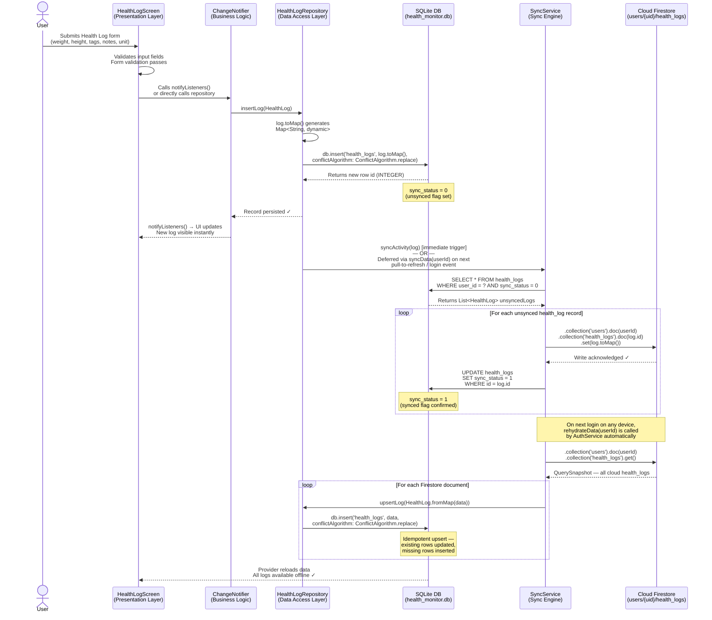

# Uplift — System Architecture Diagrams
**Group No. 13 — Descenders | ICT4153 Mobile Application Development | University of Ruhuna**
**Source of Truth:** `lib/services/auth_service.dart`, `lib/services/sync_service.dart`,
`lib/providers/activity_provider.dart`, `lib/repositories/`, `lib/database/database_helper.dart`

---

## Diagram A — Layered Architecture (The Classic View)

> Shows the strict four-layer dependency flow. Arrows represent allowed call directions only.
> No layer may communicate with a layer above it. All state flows upward via `ChangeNotifier`.

```mermaid
graph TD
    %% ── Layer 1: Presentation ─────────────────────────────────────────────
    subgraph PRESENTATION ["🖥️  Layer 1 — Presentation (UI)"]
        direction LR
        L[LoginScreen] --- D[DashboardScreen]
        D --- A[ActivityScreen]
        A --- HL[HealthLogScreen]
        HL --- G[GoalsScreen]
        G --- HT[HealthTipsScreen]
        HT --- P[ProfileScreen]
        P --- R[RemindersScreen]
        P --- C[ChartsScreen]
        D --- WIDGETS["Matte-Glass Widgets\nGlassCard · WeeklyActivityChart\nSemiCircleProgressPainter · ShimmerCard"]
    end

    %% ── Layer 2: Business Logic ───────────────────────────────────────────
    subgraph DOMAIN ["⚙️  Layer 2 — Business Logic (Providers & Services)"]
        direction LR
        AUTH["AuthService : ChangeNotifier\n─────────────────────\n• authStateChanges() listener\n• signIn / register / logout\n• toggleTheme() → SQLite + Firestore\n• setLocale() → notifyListeners()\n• updateUserProfile()"]
        ACT_PROV["ActivityProvider : ChangeNotifier\n─────────────────────\n• loadData() → persists active_user_id\n• _runCatchUpCheck() missed-midnight fix\n• listenToPedometer()\n• getHourlyDistribution()\n• getWeeklySteps()"]
        TIPS_PROV["HealthTipsProvider : ChangeNotifier\n─────────────────────\n• fetchTipsByTag() / fetchBySearch()\n• toggleFavorite()\n• refreshCurrentList(forceRefresh)"]
        SYNC["SyncService : Singleton\n─────────────────────\n• syncData(userId)  Local→Cloud\n• rehydrateData(userId)  Cloud→Local\n• syncUserProfile(user)"]
    end

    %% ── Layer 3: Data Access ──────────────────────────────────────────────
    subgraph REPO ["📦  Layer 3 — Data Access (Repository Pattern)"]
        direction LR
        UR[UserRepository\ninsertUser · updateUser\ngetUserById]
        GR["GoalRepository\ninsertGoal · getGoalsByUser\nmarkCompleted · getPredictiveInsight()\ngetUnsyncedGoals · updateSyncStatus"]
        AR[ActivityRepository\ninsertActivity · getActivitiesByUser\nupsertActivity · getUnsyncedActivities]
        HLR[HealthLogRepository\ninsertLog · getLogsByUser\nupsertLog · getUnsyncedLogs]
        SR["StepRecordRepository\nupsertRecord (INSERT OR REPLACE)\ngetLast7DaysSteps(userId)\ngetRecordByDate()"]
        NR[NotificationService\nscheduleDaily() · showNotification()\ncancelNotification()\nBanner / Alarm channels]
        HTS[HealthTipsService\nfetchHealthTips(keyword)\nsaveFavoriteTip · getFavoriteTips\nsaveRecentTip · getRecentTips]
    end

    %% ── Layer 4: Infrastructure ───────────────────────────────────────────
    subgraph INFRA ["🗄️  Layer 4 — Infrastructure"]
        direction LR
        SQLITE[("SQLite — Primary\nhealth_monitor.db\nSchema v11\n9 Tables")]
        FIREBASE_AUTH["Firebase Auth\nEmail/Password\nGoogle OAuth"]
        FIRESTORE[("Cloud Firestore — Secondary\nusers/{uid}/goals\nusers/{uid}/activities\nusers/{uid}/health_logs")]
        HIVE[("Hive Disk Cache\ndio_cache_interceptor\nHealth Tips HTTP cache\n7-day TTL")]
        HEALTH_API["MyHealthFinder API\nhealth.gov REST\nKeyword search\nJSON response"]
        SHARED_PREF["SharedPreferences\nactive_user_id\nlast_active_date\ncurrent_steps\ntutorial flags"]
        SENSOR["Android Pedometer\nHardware Step Sensor\nMonotonic step count\nsince last reboot"]
        BG_SERVICE["flutter_background_service\nBackground Isolate\nMidnight step capture\nPeriodic sync trigger"]
    end

    %% ── Cross-Layer Connections ───────────────────────────────────────────
    PRESENTATION -->|"context.watch / Consumer\ndispatches user events"| DOMAIN
    DOMAIN -->|"CRUD operations\nasync/await"| REPO
    REPO -->|"db.insert / db.query\nConflictAlgorithm.replace"| SQLITE
    SYNC -->|".set(toMap())\n.get() subcollections"| FIRESTORE
    AUTH -->|"createUserWithEmailAndPassword\nsignInWithCredential"| FIREBASE_AUTH
    HTS -->|"Dio GET + cache interceptor"| HIVE
    HIVE -->|"Cache miss → HTTP GET"| HEALTH_API
    ACT_PROV -->|"read/write\nactive_user_id"| SHARED_PREF
    BG_SERVICE -->|"reads active_user_id\nwrites step_records"| SQLITE
    BG_SERVICE -->|"reads stepCount stream"| SENSOR
    NR -->|"zonedSchedule()\nflutter_local_notifications"| SHARED_PREF

    %% ── Styling ───────────────────────────────────────────────────────────
    style SQLITE         fill:#e8d5f5,stroke:#7c3aed,stroke-width:2px
    style FIRESTORE      fill:#fef3c7,stroke:#d97706,stroke-width:2px
    style HIVE           fill:#dcfce7,stroke:#16a34a,stroke-width:1px
    style AUTH           fill:#dbeafe,stroke:#2563eb,stroke-width:1px
    style SYNC           fill:#dbeafe,stroke:#2563eb,stroke-width:2px
    style ACT_PROV       fill:#dbeafe,stroke:#2563eb,stroke-width:1px
    style TIPS_PROV      fill:#dbeafe,stroke:#2563eb,stroke-width:1px
    style BG_SERVICE     fill:#fce7f3,stroke:#be185d,stroke-width:2px
    style SENSOR         fill:#fce7f3,stroke:#be185d,stroke-width:1px
```

---

## Diagram B — Localisation & Theming Flowchart

> Traces the exact code path when a user switches the UI language from English to Sinhala.
> Grounded in: `AuthService.setLocale()`, `MaterialApp(locale:)`, and the `_siSize` font helper.

```mermaid
flowchart LR
    A(["👤 User selects\n'සිංහල' in ProfileScreen"])

    subgraph PROFILE ["ProfileScreen — Presentation Layer"]
        B["Calls\ncontext.read<AuthService>()\n.setLocale(Locale('si'))"]
    end

    subgraph AUTH_SVC ["AuthService — Domain Layer"]
        C{"_locale == newLocale?"}
        D["_locale = Locale('si')\nnotifyListeners()"]
    end

    subgraph MATERIAL ["MaterialApp — Root Widget"]
        E["Consumer<AuthService>\nrebuilds MaterialApp\nlocale: authService.locale"]
        F["Flutter framework loads\nlocalizations delegate:\nAppLocalizations.delegate\nGlobalMaterialLocalizations.delegate\nGlobalWidgetsLocalizations.delegate"]
        G["Resolves app_si.arb\nARB key-value translations\nloaded into AppLocalizations"]
    end

    subgraph FONT_SCALE ["UI Render — Font Scaling"]
        H{"Active locale\n== 'si'?"}
        I["Apply _siSize()\nreduced scale factor\ne.g. 16px → ~14px\n~15% reduction for\nSinhala conjunct characters"]
        J["Standard font size\napplied\nno scaling override"]
        K(["✅ UI renders in Sinhala\nNo text overflow in\nBottomNavigationBar labels\nor fixed-width card headers"])
    end

    A --> B
    B --> C
    C -->|"No — same locale"| K
    C -->|"Yes — new locale"| D
    D --> E
    E --> F
    F --> G
    G --> H
    H -->|"Yes"| I
    H -->|"No (en)"| J
    I --> K
    J --> K

    style A         fill:#f0fdf4,stroke:#16a34a
    style D         fill:#dbeafe,stroke:#2563eb
    style G         fill:#fef3c7,stroke:#d97706
    style I         fill:#fce7f3,stroke:#be185d,stroke-width:2px
    style K         fill:#dcfce7,stroke:#16a34a,stroke-width:2px
```



---

## Diagram C — Data Synchronisation Sequence Diagram

> Traces the full lifecycle of a Health Log entry from user input through local persistence
> to cloud synchronisation. Grounded in: `HealthLogRepository`, `SyncService.syncData()`,
> `SyncService.rehydrateData()`, and the `sync_status` flag mechanism.



---

## Diagram Notes

### Diagram A — Layered Architecture
| Decision | Rationale |
|---|---|
| Lazy getters across repositories | Prevents circular dependency & startup memory overhead |
| `SyncService` as singleton | Ensures a single sync queue; avoids duplicate Firestore writes |
| `BackgroundStepService` in separate isolate | `flutter_background_service` requires its own Dart isolate; Firebase Auth unavailable there — bridged via `SharedPreferences active_user_id` |
| `HiveCacheStore` for Health Tips | Survives app restarts; `dio_cache_interceptor` serves cached response instantly before network call |

### Diagram B — Localisation
| Decision | Rationale |
|---|---|
| Locale state in `AuthService` | Single `ChangeNotifier` at root propagates locale to all consumers via `MaterialApp(locale:)` |
| `_siSize()` font reduction | Sinhala Unicode conjunct characters render ~15% wider than Latin at the same `fontSize`; explicit scaling prevents `BottomNavigationBar` label overflow |
| No database column for locale | Locale is a session preference held in `AuthService._locale`; it does not persist across reinstalls (by design) |

### Diagram C — Sync Sequence
| Step | Implementation Detail |
|---|---|
| Immediate local write | `ConflictAlgorithm.replace` ensures idempotency — safe to call multiple times |
| `sync_status = 0` flag | Set at insert time; `SyncService.syncData()` queries for this flag to identify unsynced records |
| Error handling | All `SyncService` methods wrap Firestore calls in `try/catch`; failures are logged but do not block the UI — the record retains `sync_status = 0` for the next sync cycle |
| Rehydration on login | `AuthService` constructor listens to `_auth.authStateChanges()` and calls `rehydrateData()` then `syncData()` on every authenticated state event |

---
*Source: `lib/services/auth_service.dart`, `lib/services/sync_service.dart`, `lib/providers/activity_provider.dart`, `lib/repositories/health_log_repository.dart`, `lib/database/database_helper.dart` (v11)*
*Group No. 13 — Descenders | April 2026*
