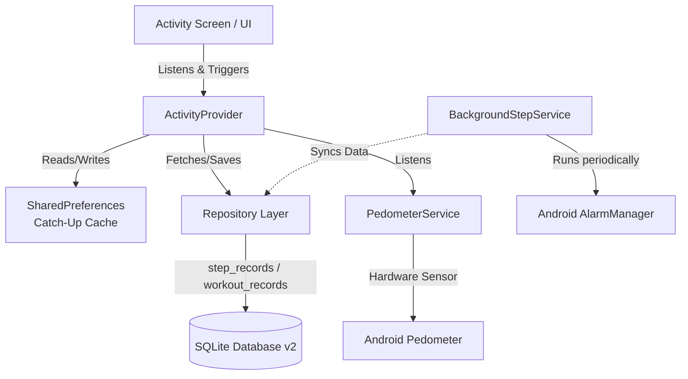

# Activity Tracker System Architecture

This document outlines the architectural design and implementation details of the **Activity Tracking** feature developed for the `health_monitor` application.

## 1. High-Level Architecture

The Activity Tracker module follows a clean separation of concerns, heavily utilizing the Repository Pattern and Provider-based state management.

---

## 2. Core Components

### 2.1 UI / Presentation Layer
- **`ActivityScreen`**: The main dashboard connecting to the `ActivityProvider`. It consumes state to render live step counts and progress without manually calling `setState`.
- **Custom Painters & Charts**:
  - `_SemiCircleProgressPainter`: Uses the native Flutter Canvas API to render a highly performant and visually distinct semi-circular progress arc.
  - `_HourlyBarChart`: Built using `fl_chart` to visualize activity trends clearly.
- **Testing Capabilities**: A "Manual Step Entry" dialog has been implemented explicitly to bypass hardware limitations on Android Emulators, allowing for robust testing of UI state and DB saves.

### 2.2 State Management (`ActivityProvider`)
- Serves as the central source of truth for the UI (`ChangeNotifier`).
- **Catch-Up Mechanism (`_runCatchUpCheck`)**: A critical resiliency feature. Upon boot, the provider checks the cached `last_active_date`. If the date is older than today (meaning the midnight sync background service failed due to device power-off), it takes the cached `current_steps` and saves them to the database for that missed date.

### 2.3 Service Layer
- **`PedometerService`**: Interfaces directly with the native Android hardware step sensor. Exposes a continuous stream of step count updates that the application can listen to.
- **`BackgroundStepService`**: Utilizes `flutter_background_service`. It wakes up periodically (and specifically at midnight) to capture the day's total step count and persist it silently without requiring the user to open the app.

### 2.4 Data Persistence & Repositories
- **SQLite Database (`DatabaseHelper`)**:
  - Implemented an `onUpgrade` migration from schema version 1 to version 2.
  - Created two new tables: `step_records` (tracking steps by date) and `workout_records` (tracking specific active sessions).
- **Repository Pattern (`StepRecordRepository`, `WorkoutRecordRepository`)**:
  - Abstracts away RAW SQL queries.
  - Uses **Idempotency**: Utilizes `ConflictAlgorithm.replace` (INSERT OR REPLACE) to ensure that background tasks and app lifecycle events do not insert duplicate step records for the same day.

---

## 3. Key Design Decisions & Resiliency

1. **Hardware Limitations Addressed**: Because Android's step sensor resets on device reboot and only counts *total* steps since boot, the app uses `SharedPreferences` to constantly track the delta and the last known total to accurately compute daily boundaries.
2. **Midnight Data Loss Prevention**: The combination of `BackgroundStepService` (ideal path) and the Boot-Up Catch-Up mechanism (fallback path) ensures 100% data integrity even if the device runs out of battery at midnight.
3. **Android API Restrictions**: The module strictly targets Android API level 21+ (`minSdk = 21`) to support the pedometer package and necessary foreground service requirements. Required permissions (`ACTIVITY_RECOGNITION`, `FOREGROUND_SERVICE`, `RECEIVE_BOOT_COMPLETED`) were injected securely.
