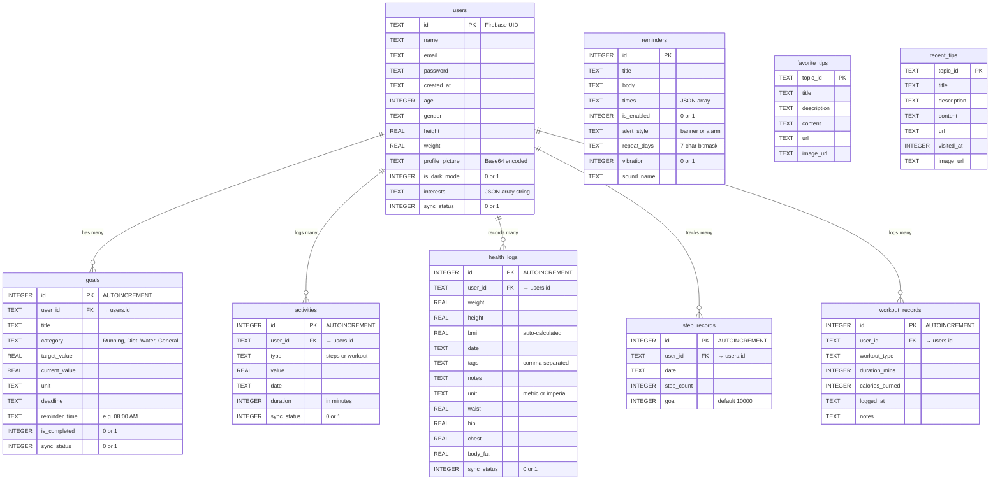

# Health Monitor Application — Database ER Diagram

## ER Diagram

## Relationship Summary

| Relationship | Type | FK Constraint |
|---|---|---|
| `users` → `goals` | One-to-Many | `goals.user_id` → `users.id` (ON DELETE CASCADE) |
| `users` → `activities` | One-to-Many | `activities.user_id` → `users.id` (ON DELETE CASCADE) |
| `users` → `health_logs` | One-to-Many | `health_logs.user_id` → `users.id` (ON DELETE CASCADE) |
| `users` → `step_records` | One-to-Many | `step_records.user_id` → `users.id` (ON DELETE CASCADE) |
| `users` → `workout_records` | One-to-Many | `workout_records.user_id` → `users.id` (ON DELETE CASCADE) |
| `reminders` | Standalone | No FK — device-local only |
| `favorite_tips` | Standalone | No FK — device-local only |
| `recent_tips` | Standalone | No FK — device-local only |

## Sync Architecture

- Tables with `sync_status`: `users`, `goals`, `activities`, `health_logs` → synced to **Firebase Firestore**
- Firestore path: `users/{userId}/goals/{goalId}`, `users/{userId}/activities/{activityId}`, `users/{userId}/health_logs/{logId}`
- `reminders`, `favorite_tips`, `recent_tips`, `step_records`, `workout_records` → **local-only (SQLite)**
