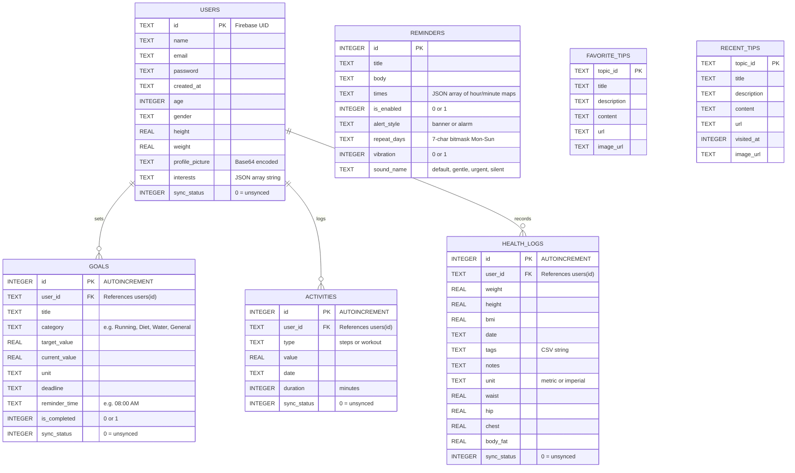

# Health Monitor — Entity-Relationship Diagram

## ER Diagram

---

## Relationship Summary

| Relationship | Type | FK Constraint | Description |
|---|---|---|---|
| **Users → Goals** | One-to-Many | `goals.user_id → users.id` (ON DELETE CASCADE) | A user sets zero or more health goals |
| **Users → Activities** | One-to-Many | `activities.user_id → users.id` (ON DELETE CASCADE) | A user logs zero or more activities |
| **Users → Health Logs** | One-to-Many | `health_logs.user_id → users.id` (ON DELETE CASCADE) | A user records zero or more health logs |
| **Reminders** | Standalone | — | Not user-scoped; device-local notification schedules |
| **Favorite Tips** | Standalone | — | Locally cached bookmarked health tips |
| **Recent Tips** | Standalone | — | Locally cached recently viewed tips |

---

## Entity Details

### 🧑 Users
The central entity. Stores Firebase UID as primary key, profile data (age, gender, height, weight, profile picture), and a JSON-encoded list of interest topics used for personalising Health Tips.

### 🎯 Goals
Tracks health goals per user with category-based tracking (Running, Diet, Water, etc.), target/current progress values, deadlines, and optional reminder times.

### 🏃 Activities
Records user activity entries — either `steps` or `workout` — with a numeric value, date, and duration in minutes.

### 📋 Health Logs
Body measurement snapshots — weight, height, auto-calculated BMI, optional body measurements (waist, hip, chest, body fat), and tagging/notes. Supports metric & imperial units.

### ⏰ Reminders
Device-local notification configuration. Stores a JSON array of `{hour, minute}` maps to support multiple daily reminder times, along with alert style (banner vs. persistent alarm), day-of-week repeat bitmask, vibration toggle, and sound selection.

### ⭐ Favorite Tips / 🕐 Recent Tips
Offline caches for health tip articles fetched from an external API. Favorite Tips are user-bookmarked; Recent Tips track visit history via `visited_at` timestamp.
