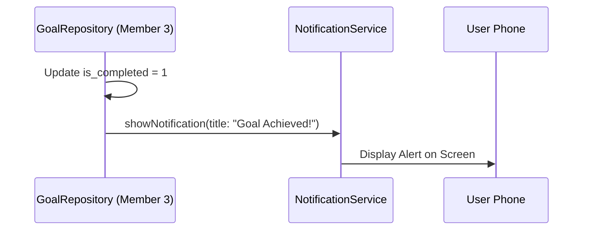
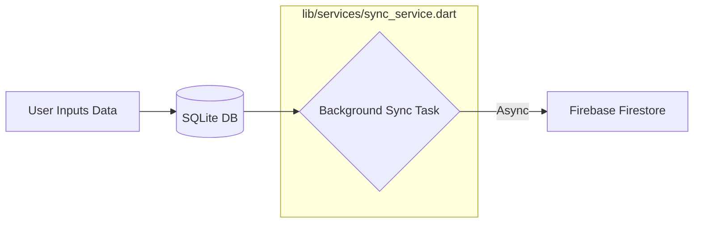
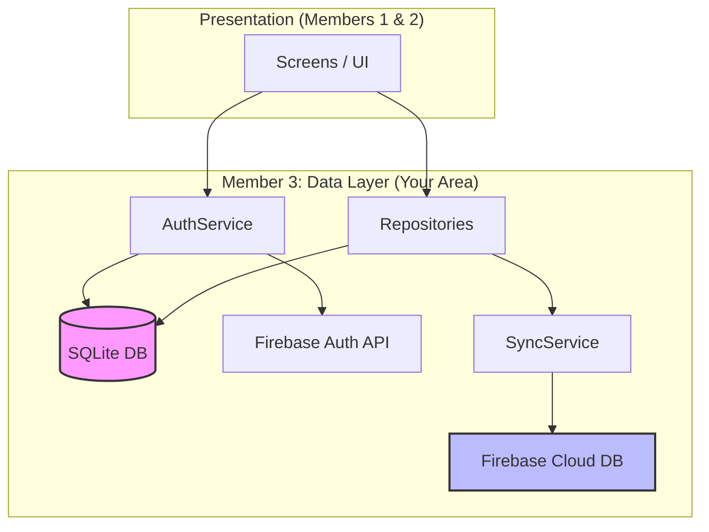

# Member 3: LakiDev (LSR Vidanaarachchi)
**Regno:** TG/2020/1010
**Role:** Database & Data Layer (SQLite Schema, Repository Pattern)

---

## 🗺 Your Component Map & File Breakdown
This section separates your project into your **Viva Requirements** and your **Functional Requirements**.

### 🏛 Area 1: The Foundation (Viva Task)
*These files are what you will show the examiner to prove your knowledge of SQLite and Architecture.*

| Category | File Path | Purpose |
| :--- | :--- | :--- |
| **Database Engine** | `lib/database/database_helper.dart` | The "Heart" of your local storage. Manages table creation and versioning. |
| **Data Models** | `lib/models/user.dart` `lib/models/goal.dart` `lib/models/activity.dart` `lib/models/health_log.dart` | Defines what a "User" or "Goal" looks like in Dart. These are the blueprints for your data. |
| **Repositories** | `lib/repositories/user_repository.dart` `lib/repositories/goal_repository.dart` `lib/repositories/activity_repository.dart` `lib/repositories/health_log_repository.dart` | The "Gatekeepers." They contain the actual SQL commands to Save, Load, and Delete data locally. |

---

## 📱 Device Feature Integration (Member 3 Contributions)
Although your primary role is the Data Layer, your logic powers two critical device features.

### 1. Push Notifications (The "Nudge" System)
**Concept:** Using Data Analysis to trigger local notifications.

| Code Reference | Exact Location | Logic Explained |
| :--- | :--- | :--- |
| **Primary File** | `lib/repositories/goal_repository.dart` | The Repository contains the logic to decide when a user needs a nudge. |
| **Method** | `markCompleted()` | When a goal is finished, it triggers a notification to congratulate the user. |
| **Helper Service** | `lib/services/notification_service.dart` | The standard utility used to show the physical alert on the phone. |

**Real-Life Scenario:** A user finishes their "10km Run" goal. The `markCompleted` method in your Repository detects the status change and immediately tells the `NotificationService` to show a "Goal Achieved! 🎉" message.

---

### 2. Background Tasks (The "Shadow Sync")
**Concept:** Running data synchronization in the background without freezing the UI.

| Code Reference | Exact Location | Logic Explained |
| :--- | :--- | :--- |
| **Primary File** | `lib/services/sync_service.dart` | This service runs the background logic for Firestore mirroring. |
| **Methods** | `syncGoal()`, `syncActivity()` | These methods send data to Firebase in the background using `async` calls. |
| **Triggers** | `insert...()` in all Repositories | Every time data is saved to SQLite, it triggers the background sync automatically. |

**Real-Life Scenario:** A user logs a workout while hiking (Offline). The `ActivityRepository` saves it to SQLite. As soon as signal returns, the `SyncService` background task automatically mirrors that record to **Cloud Firestore**.

---

## 🔄 Component Interaction Graph
This graph shows how the files you manage (Member 3) interact with the rest of the app.

---

## 📝 Developer Notes (Viva Prep)
- **Primary vs Secondary:** "SQLite is our **Primary** database for speed and offline use. Firebase is our **Secondary** database for cloud backup."
- **Predictive Analytics:** "I implemented a linear regression logic in `GoalRepository` to estimate goal completion dates based on current user velocity."
