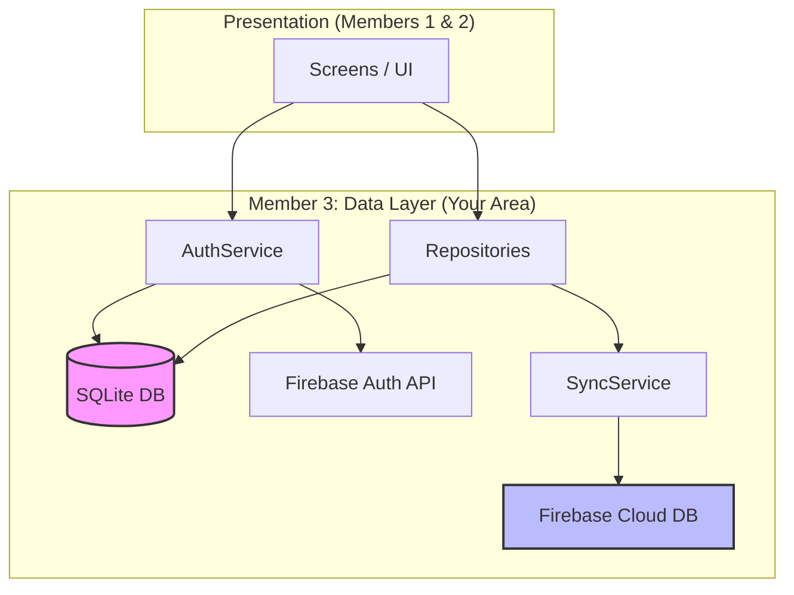

# Member 3: LakiDev (LSR Vidanaarachchi)
**Regno:** TG/2020/1010
**Role:** Database & Data Layer (SQLite Schema, Repository Pattern)

---

## 🗺 Your Component Map & File Breakdown
This section separates your project into your **Viva Requirements** and your **Functional Requirements**.

### 🏛 Area 1: The Foundation (Viva Task)
*These files are what you will show the examiner to prove your knowledge of SQLite and Architecture.*

| Category | File Path | Purpose |
| :--- | :--- | :--- |
| **Database Engine** | `lib/database/database_helper.dart` | The "Heart" of your local storage. Manages table creation and versioning. |
| **Data Models** | `lib/models/user.dart` `lib/models/goal.dart` `lib/models/activity.dart` `lib/models/health_log.dart` | Defines what a "User" or "Goal" looks like in Dart. These are the blueprints for your data. |
| **Repositories** | `lib/repositories/user_repository.dart` `lib/repositories/goal_repository.dart` `lib/repositories/activity_repository.dart` `lib/repositories/health_log_repository.dart` | The "Gatekeepers." They contain the actual SQL commands to Save, Load, and Delete data locally. |

### 🚀 Area 2: The Features (Implementation Task)
*These files handle the advanced features: Secure Auth, Cloud Sync, and Smart Goals.*

| Category | File Path | Purpose |
| :--- | :--- | :--- |
| **Security (Auth)** | `lib/services/auth_service.dart` | Handles Login/Register via Firebase. It also ensures the user is "Remembered" when the app restarts. |
| **Cloud Sync** | `lib/services/sync_service.dart` | The "Mirror." It sends your SQLite data to Firebase Firestore so it's never lost. |
| **Android Config** | `android/app/google-services.json` `android/app/build.gradle.kts` | The "Bridge" that allows your Android app to talk to Google's Firebase servers. |

---

## 🔄 Component Interaction Graph
This graph shows how the files you manage (Member 3) interact with the rest of the app.

---

## 💡 How connectivity works in your Dart files:
1.  **Imports:** At the top of each file, you see `import '...'`. This is how one file "grabs" the tools from another. For example, `goal_repository.dart` imports `sync_service.dart` so it can mirror data to the cloud.
2.  **Asynchronous (Future):** You will see `async` and `await` everywhere. This means "wait for the database/internet to finish." Since talking to SQLite or Firebase takes a split second, Dart uses these keywords to keep the app from freezing.
3.  **The Flow:**
    - User clicks "Save Goal" -> **UI** calls **Repository**.
    - **Repository** saves to **SQLite**.
    - **Repository** then asks **SyncService** to backup to **Firebase**.

---

## 🚦 Implementation Status (Summary)
- [x] **SQLite Schema:** Relational tables (User -> Goals/Activities) are ready.
- [x] **Auth:** Firebase Login/Register is fully functional.
- [x] **Sync:** Automatic SQLite-to-Firestore mirroring is active.
- [x] **Smart Logic:** Predictive goal completion calculation is implemented in `GoalRepository`.

---

## 📝 Developer Notes (Viva Prep)
- **Primary vs Secondary:** "SQLite is our **Primary** database for speed and offline use. Firebase is our **Secondary** database for cloud backup and multi-device sync."
- **Separation of Concerns:** "By using a **SyncService**, we keep the Firebase logic out of our Repositories, making the code easier to test and maintain."
