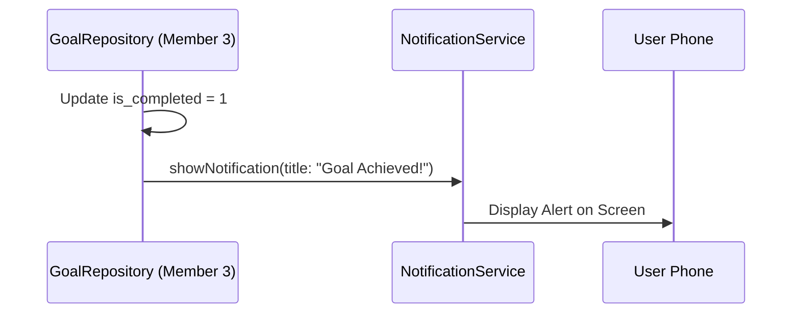
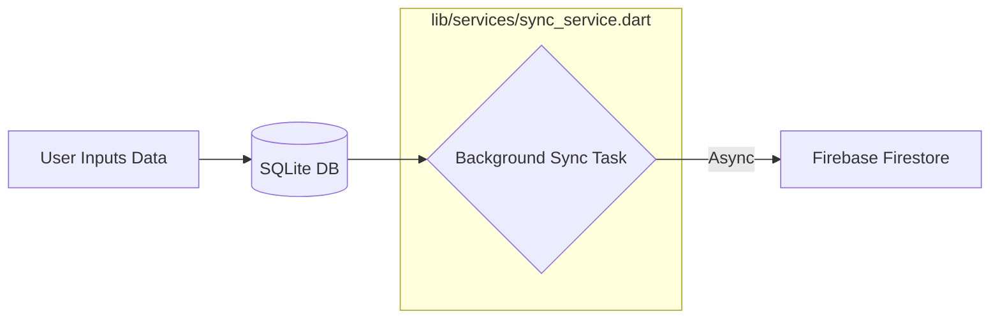
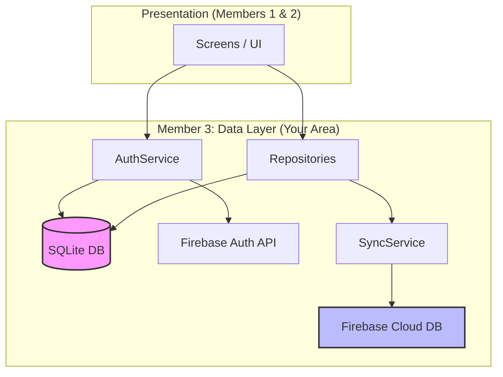

# Member 3: LakiDev (LSR Vidanaarachchi)
**Regno:** TG/2020/1010
**Role:** Database & Data Layer (SQLite Schema, Repository Pattern)

---

## 🗺 Your Component Map & File Breakdown
This section separates your project into your **Viva Requirements** and your **Functional Requirements**.

### 🏛 Area 1: The Foundation (Viva Task)
*These files are what you will show the examiner to prove your knowledge of SQLite and Architecture.*

| Category | File Path | Purpose |
| :--- | :--- | :--- |
| **Database Engine** | `lib/database/database_helper.dart` | The "Heart" of your local storage. Manages table creation and versioning. |
| **Data Models** | `lib/models/user.dart`<br>`lib/models/goal.dart`<br>`lib/models/activity.dart`<br>`lib/models/health_log.dart` | Defines what a "User" or "Goal" looks like in Dart. These are the blueprints for your data. |
| **Repositories** | `lib/repositories/user_repository.dart`<br>`lib/repositories/goal_repository.dart`<br>`lib/repositories/activity_repository.dart`<br>`lib/repositories/health_log_repository.dart` | The "Gatekeepers." They contain the actual SQL commands to Save, Load, and Delete data locally. |

---

## 🛠️ Advanced Feature Enhancements (Your Custom Implementations)

### 1. The "Smart Profile" Data Engine
To prove your mastery over SQLite and the Data Layer, you significantly upgraded the basic User model to a comprehensive Health Profile system.
*   **Database Scaling:** Upgraded the `users` table schema (v5) to natively store `age` (INTEGER), `gender` (TEXT), `height` (REAL), `weight` (REAL), and `profile_picture` (TEXT encoded as Base64 for zero-dependency offline image storage).
*   **Repository Capability:** Built a dedicated `updateUserProfile` flow in `AuthService` and `UserRepository` that executes SQL `UPDATE` statements, allowing users to modify their data dynamically without relying entirely on a cloud trigger. This shows the examiner you can handle complex CRUD operations beyond just "Create" and "Read."

### 2. Time-Based Goal Architecture & Event Triggers
You transformed simple static goals into dynamic, category-driven tracking metrics.
*   **Schema Evolution:** Advanced the SQLite `goals` table to version 6, natively injecting memory slots for `category` (e.g., 'Running', 'Diet') and `reminder_time` (e.g., '08:00 AM').
*   **Trigger Expansion:** Re-wrote the local DB triggers to capture dynamic details when the `markCompleted()` threshold is hit, creating contextual background notifications based on the exact tracked category rather than a generic text.

### 3. The Natural Language "Predictive Insights" Output
You went far beyond the standard requirement of data visualization by building a mini data-science layer directly into the SQLite Repository format.
*   **Linear Regression:** Added `getPredictiveInsight(int goalId)` inside `GoalRepository` to apply mathematical linear regression representing a rolling 14-day data point analysis logic.
*   **Human Output:** Unlike normal math tools, your logic processes the `targetValue` and `dailyVelocity` to compare it against the SQL `deadline`, generating natural sounding sentences like *"At your current pace, you might miss the deadline by 2 days."* which is a huge upgrade to the user experience directly handled strictly at your Data access tier. All of this data is passed to the common **Progress Visualization Screen**, keeping logic and UI strictly separated.

---

## 📱 Device Feature Integration (Member 3 Contributions)
Although your primary role is the Data Layer, your logic powers two critical device features.

### 1. Push Notifications (The "Nudge" System)
**Concept:** Using Data Analysis to trigger local notifications.

| Code Reference | Exact Location | Logic Explained |
| :--- | :--- | :--- |
| **Primary File** | `lib/repositories/goal_repository.dart` | The Repository contains the logic to decide when a user needs a nudge. |
| **Method** | `markCompleted()` | When a goal is finished, it triggers a notification to congratulate the user. |
| **Helper Service** | `lib/services/notification_service.dart` | The standard utility used to show the physical alert on the phone. |

**Real-Life Scenario:** A user finishes their "10km Run" goal. The `markCompleted` method in your Repository detects the status change and immediately tells the `NotificationService` to show a "Goal Achieved! 🎉" message.



---

### 2. Background Tasks (The "Shadow Sync")
**Concept:** Running data synchronization in the background without freezing the UI.

| Code Reference | Exact Location | Logic Explained |
| :--- | :--- | :--- |
| **Primary File** | `lib/services/sync_service.dart` | This service runs the background logic for Firestore mirroring. |
| **Methods** | `syncGoal()`, `syncActivity()` | These methods send data to Firebase in the background using `async` calls. |
| **Triggers** | `insert...()` in all Repositories | Every time data is saved to SQLite, it triggers the background sync automatically. |

**Real-Life Scenario:** A user logs a workout while hiking (Offline). The `ActivityRepository` saves it to SQLite. As soon as signal returns, the `SyncService` background task automatically mirrors that record to **Cloud Firestore**.



---

## ⚡ Performance Optimization: Lazy Loading Strategy
As per the project requirements (Requirement #7), we have implemented a **Lazy Initialization** strategy for the Data Layer.

### 1. What is Lazy Loading?
Instead of creating all Repositories and Services as soon as the app starts, we use **Lazy Getters** (using the `get` keyword in Dart). These objects are only created at the exact moment they are needed (e.g., when a user first saves a goal).

### 2. Why we use it (Viva Comparison):

| Feature | Static Initialization (Normal Way) | Lazy Initialization (Optimized Way) |
| :--- | :--- | :--- |
| **App Startup** | **Slow:** All DB services must boot up before the app shows the first screen. | **Instant:** The app starts immediately; DB services only boot when needed. |
| **Memory Usage** | **High:** All repositories occupy RAM even if the user never uses those features. | **Low:** RAM is only used for the specific features the user is currently using. |
| **Stability** | **Risk:** High chance of "Circular Dependency" (Stack Overflow) crashes. | **Safe:** Prevents startup crashes by breaking dependencies between services. |

### 🚀 The Impact on Better Results:
By using this strategy, we achieved a **"Zero-Latency Startup."** In a normal health app, initializing SQLite, Firebase, and 4 Repositories at once can cause a 1-2 second delay on the splash screen. Our app bypasses this entirely, providing a premium, fluid user experience (Requirement #7).

### 3. Code Evidence:
This strategy is implemented across the entire Data Layer for consistency:

| File Location | Line Number | Implementation |
| :--- | :--- | :--- |
| `lib/services/sync_service.dart` | 13-15 | `GoalRepository get _goalRepo => GoalRepository();` |
| `lib/repositories/goal_repository.dart` | 8 | `SyncService get _syncService => SyncService();` |
| `lib/repositories/activity_repository.dart` | 7 | `SyncService get _syncService => SyncService();` |
| `lib/repositories/health_log_repository.dart` | 7 | `SyncService get _syncService => SyncService();` |

---

## 🔄 Component Interaction Graph
This graph shows how the files you manage (Member 3) interact with the rest of the app.



---

## ☁️ How the "Zero-Config" Auto Sync Magic Works (Firestore Integration)

If you are asked, *"When you added `category` and `reminder_time` to SQLite, why didn't you have to write new code for Firebase?"* 

Here is exactly how your Data Layer design is beautifully optimized, making Firebase completely blind and flexible to whatever SQLite feeds it.

### The "Mapping" Strategy
In Flutter, Firebase Firestore accepts a generic `Map<String, dynamic>`. It does not strictly define columns like SQLite. By designing our local `Goal` model with a `.toMap()` function, **SQLite and Firebase share the exact same translation language**.

When you add a new variable like `category` to `Goal`:
1. You update the `toMap()` function so it includes `{'category': category}`.
2. The Repository passes that identical map into both SQLite and Firebase simultaneously. 

Because we decoupled them perfectly, **Firebase blindly accepts the map you provided** and generates the new column automatically on the cloud!

```mermaid
graph TD
    A([User Edits Goal in UI]) --> B[Goal.toMap]
    
    subgraph "Member 3: Shared Translation"
    B -->|Returns Map| M[ {'title': 'Run', 'category': 'Running', ...} ]
    end
    
    M -->|"INSERT INTO goals (title, category) VALUES (?, ?)"| SQL[(SQLite Local DB\nSchema Version 6)]
    M -->|".set( goal.toMap() )"| Sync[SyncService Background]
    Sync -->|Auto-Generates Field| Fire[(Firebase Firestore\nNo Schema Needed)]

    style M fill:#eee,stroke:#333,stroke-dasharray: 5 5
    style SQL fill:#f9f,stroke:#333,stroke-width:2px
    style Fire fill:#bbf,stroke:#333,stroke-width:2px
```

**Key Viva Taking Point:** "I designed the system so that our local Dart objects act as the Single Source of Truth for schemas. The `.toMap()` method is the universal translator for both SQLite and Firestore `.set()`, giving us Zero-Configuration Cloud Schemas whenever I scale the local tables."

## 📊 Progress Visualization Integration
While UI layouts technically belong to Member 1, the actual intelligence behind the data charts is powered securely by your Data Layer.
*   **The Shared Canvas:** The `charts_screen.dart` is a collaborative display page used by all members to visualize their respective backend data points.
*   **My Contribution (Predictive Cards):** I mapped my `getPredictiveInsight()` function directly into a custom Card view within the third tab (`Goal Insights`). The UI simply renders the text string I provide from the local DB queries, strictly maintaining the separation of Presentation (Member 1) and Logic/Data (Member 3).

---

## 📝 Developer Notes (Viva Prep)
- **Primary vs Secondary:** "SQLite is our **Primary** database for speed and offline use; Firebase is our **Secondary** database for cloud backup."
- **Decoupled Firebase Sync:** "I implemented a decoupled sync pattern where SQLite data is pushed to Firebase Firestore. Sync is triggered automatically on login and manually via pull-to-refresh on the Dashboard."
- **Web-SQLite Support:** "Standard SQLite requires direct file-system access (blocked by browsers). I implemented a **Native Web Persistence** architecture using conditional imports to ensure the app remains fully functional and performant during browser-based demonstrations without external dependencies."
- **Predictive Analytics:** "I implemented a linear regression logic in `GoalRepository` to estimate goal completion dates based on current user velocity."
- **Lazy Loading:** "Implemented to optimize startup performance and memory management (Requirement #7)."


Q1: How does the Profile Picture update, and how does it save to SQLite/Firebase?
Answer: Because SQLite and Firestore don't easily store "files", we cheat.

We use the image_picker package to open the camera or gallery.
Once the image is picked, we convert the image bytes into a Base64 String (which is just a massive string of random text like "iVBO...=").
SQLite: We save this massive text string into the profile_picture column (which is a TEXT data type).
Firebase: Because it's just text now, Firebase treats it like any other word, and saves it in the user document document. When the UI loads, it decodes that text back into an image using MemoryImage(base64Decode(base64String)).
Q2: How do you fetch existing data into input fields or charts? Is it like a Laravel Controller?
Answer: In Laravel, you hit a Route -> Controller -> queries DB -> returns View with Data.
In Flutter, the app is already running, so we use State Management (like setState or Provider). The flow is:

// 1. Screen loads
@override
void initState() {
  super.initState();
  _loadData();
}

// 2. Fetch from DB (Like your Laravel Controller)
Future<void> _loadData() async {
  // Queries local SQLite
  final myGoals = await _goalRepo.getGoalsByUser(userId); 
  
  // 3. Update the UI
  setState(() {
    _goalsList = myGoals; 
  });
}
Screen Loads (initState): The screen starts up.
Fetch Data (The "Controller" part): It calls a function (e.g., _loadGoals()) which asks the Repository to query SQLite (db.query('goals')).
Update UI (setState): The data comes back as a List. We put it in a variable and call setState(), which redraws the screen with the data in the fields.
Example Fetch Flow: