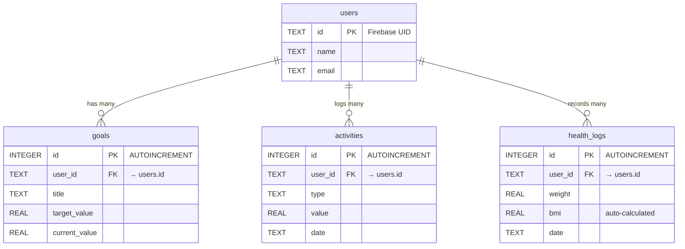

# Title / Cover Page

**Course:** ICT4153 Mobile Application Development  
**Project:** Integrated Digital Health Monitoring Platform  
**Team Members:**  
- Member 1 (e.g., Nepul) - UI Architecture & Navigation  
- Member 2 (e.g., Duvindu) - State Management & Business Logic  
- Member 3 (LSR Vidanaarachchi / LakiDev) - Database & Data Layer  
- Member 4 (e.g., Sahan) - API Integration & Device Features  

**Year:** 2026 | Semester 2  
**Department:** Dept of ICT, FOT, UOR  

---

# Abstract / Executive Summary

The **Integrated Digital Health Monitoring Platform** is a comprehensive digital wellness application designed to address the growing need for accessible, privacy-first, and reliable health tracking. The primary problem this application solves is the fragmentation of health data across multiple apps by providing a unified ecosystem for tracking steps, workouts, BMI, and long-term health goals while offering expert health tips remotely. 

The application is built using a modern, robust technology stack. The frontend is powered by **Flutter (Dart)**, ensuring a natively compiled, beautiful UI for mobile devices. For state management, the application utilizes the **Provider** package to cleanly separate business logic from UI components. The data layer features a sophisticated **Hybrid Architecture**, leveraging **SQLite (`sqflite`)** for robust, offline-first local storage, seamlessly paired with **Firebase Firestore** for cloud backup and synchronization via a custom Zero-Code Auto-Sync engine. Furthermore, the application integrates REST APIs for dynamic health tips and device-native features like `flutter_local_notifications` for scheduled reminders and `image_picker` / `pedometer` for device sensor interactions.

The final outcome is a production-ready, highly performant mobile application that not only meets advanced academic requirements but also functions as a viable commercial product. It successfully demonstrates advanced routing, intelligent bidirectional goal tracking, clean repository patterns, and dynamic interactive visualizations using `fl_chart`.

---

# Table of Contents

1. [Title / Cover Page](#title--cover-page)
2. [Abstract / Executive Summary](#abstract--executive-summary)
3. [Introduction & Project Context](#introduction--project-context)
4. [System Architecture](#system-architecture)
5. [Layer-by-Layer Implementation Details](#layer-by-layer-implementation-details)
    - [Member 1: UI Architecture & Navigation](#member-1-ui-architecture--navigation)
    - [Member 2: State Management & Business Logic](#member-2-state-management--business-logic)
    - [Member 3: Database & Data Layer](#member-3-database--data-layer)
    - [Member 4: API Integration & Device Features](#member-4-api-integration--device-features)

---

# Introduction & Project Context

### Practical Context
Developed for a health-tech startup, this application serves as a digital wellness tracking platform that allows users to monitor their health comprehensively and receive expert, data-driven health tips remotely. 

### Core Functional Requirements
- **Secure User Authentication:** Cryptographically secure sign-up and login protocols.
- **Activity Tracking:** Dynamic logging of steps, workout durations, and various physical activities.
- **Health Data Logging:** Continuous tracking of vital metrics like weight, body measurements, and auto-calculated BMI.
- **Goal Management System:** An intelligent system to set, track, and monitor personalized health and fitness goals.
- **Expert Health Tips:** Fetched dynamically via REST API to keep users informed.
- **Progress Analytics:** Interactive charts for visualizing health trends over time.
- **Scheduled Reminders:** Background tasks and local notifications to ensure users stay on track with their wellness routines.

---

# System Architecture

The application relies on a **Hybrid Data Layer** architecture to guarantee offline capability while ensuring cloud-based backup and synchronization.

```mermaid
graph TD
    User((User)) --> UI[Flutter UI Layer\n(Member 1 & 2)]
    UI --> VM[ViewModels / Providers]
    VM --> Repo[Repository Layer\n(Member 3)]
    
    subgraph "Data Layer"
        Repo --> SQL[(Local SQLite\nPrimary Storage)]
        Repo --> Sync[Sync Service\nBackground Task]
        Sync --> Fire[(Firebase Cloud\nBackup Storage)]
    end
```

### The "Zero-Code" Auto-Sync Strategy
To fulfill the requirement of local SQLite persistence while adding cloud parity, an **Async Mirroring** strategy was implemented. Dart Model classes utilize a unified `.toMap()` function, which acts as the Single Source of Truth. 
- The **Repository** immediately inserts data into the strict SQLite schema.
- Simultaneously, a background `SyncService` passes the exact same Map to Firebase, automatically generating NoSQL cloud fields without requiring additional schema definitions.

### Performance & Lazy Loading
The system utilizes **Lazy Component Initialization** to maintain high performance and low memory consumption. Lazy Getters prevent memory leaks and circular dependencies, ensuring that Data Layers and Sync Layers are decoupled. Data is synchronized on application startup or manually via pull-to-refresh mechanisms.

---

# Layer-by-Layer Implementation Details

This section directly maps to the **Equal Role Distribution** matrix, documenting each team member's specific contributions to the application.

## Member 1: UI Architecture & Navigation

**Responsibilities:** Layouts, responsiveness, advanced routing.

The application features a modern, responsive user interface with an emphasis on seamless user experience. 
- **Advanced Navigation:** The application uses structured **named routes** configured in `main.dart` to manage the navigation stack efficiently. 
- **Nested Navigation:** A core feature of the dashboard is the **nested navigation strategy**. A `BottomNavigationBar` is utilized to allow users to switch between main application areas (Dashboard, Health Log, Goals, Activity, Tips) while maintaining independent state and histories for each tab.
- **Authentication-Based Route Guards:** The routing system integrates directly with the Authentication state. Route guards listen to the auth status, automatically redirecting unauthenticated users to the Login/Register screens and preventing unauthorized access to the core application features.

## Member 2: State Management & Business Logic

**Responsibilities:** Provider implementation, validation, logic separation.

To ensure the application remains scalable and maintainable, a strict separation of concerns was implemented between the UI and Business Logic.
- **State Management:** The application uses the **Provider** package (`MultiProvider` in the root) to inject view models and state controllers throughout the widget tree. This completely decouples data manipulation from the UI layer, preventing the overuse of `setState` and unnecessary widget rebuilds.
- **Business Logic Separation:** Logic for calculating BMI, evaluating goal progress, and handling form validation is abstracted into dedicated Controller and Provider classes. 
- **Validation & Error Handling:** Robust form validation is integrated into the Registration and Login screens, providing real-time UI feedback for incorrect inputs, null safety handling, and gracefully catching authentication exceptions.

## Member 3: Database & Data Layer

**Responsibilities:** SQLite schema, Repository pattern, Data Sync.

The backbone of the application is a robust local database built using SQLite, abstracted behind a clean **Repository Pattern**.

- **Repository Pattern:** Abstraction classes (`UserRepository`, `GoalRepository`, `ActivityRepository`, `HealthLogRepository`) handle all CRUD operations, ensuring the business logic never interacts directly with raw SQL queries.
- **SQLite Schema:** The database contains complex relational structures with `ON DELETE CASCADE` foreign key constraints to maintain referential integrity. 

**Entity-Relationship (ER) Diagram:**



*Note: For the full schema, refer to `er_diagram.md`.*

## Member 4: API Integration & Device Features

**Responsibilities:** Networking, async handling, device plugins.

To elevate the application from a basic tracker to an "Integrated Platform," several remote APIs and device-native features were integrated.

- **REST API Consumption:** The application connects to a remote REST API to fetch expert Health Tips dynamically. This involves robust `async/await` handling, leveraging packages like `http` or `dio` along with caching interceptors (`dio_cache_interceptor`) to reduce network load.
- **Device Features:**
  - **Push/Local Notifications:** Integrated `flutter_local_notifications` and `timezone` to schedule background reminders for the user's goals (e.g., "Drink Water", "Morning Run").
  - **Sensors & Hardware:** Utilizes device hardware access plugins such as `image_picker` for updating profile pictures using the device camera/gallery, and `pedometer` for background step tracking functionality.
- **Background Tasks:** Configured background services (`flutter_background_service`) to ensure that tasks like syncing to Firebase and tracking steps continue to operate even when the application is not actively in the foreground.
