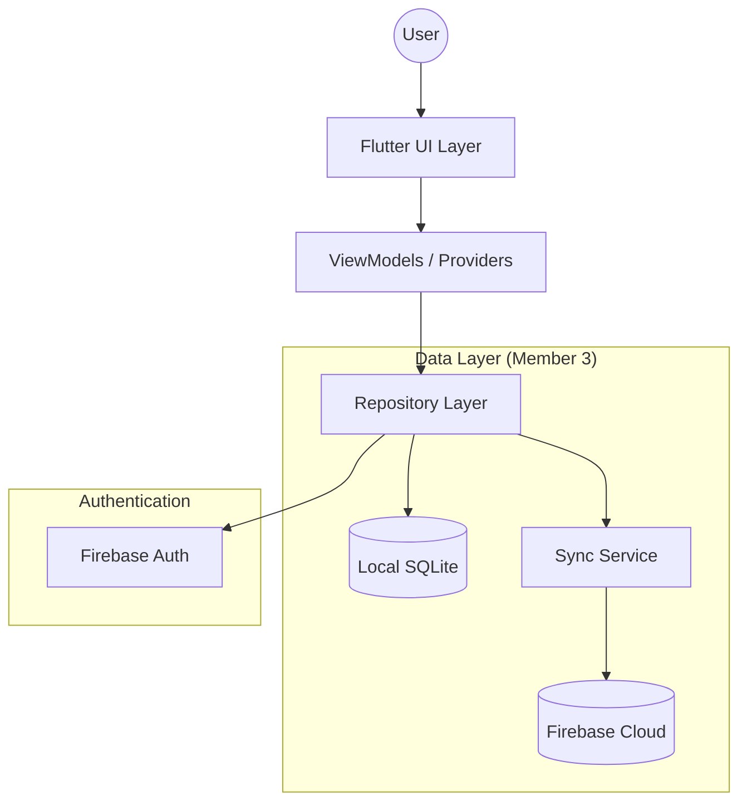
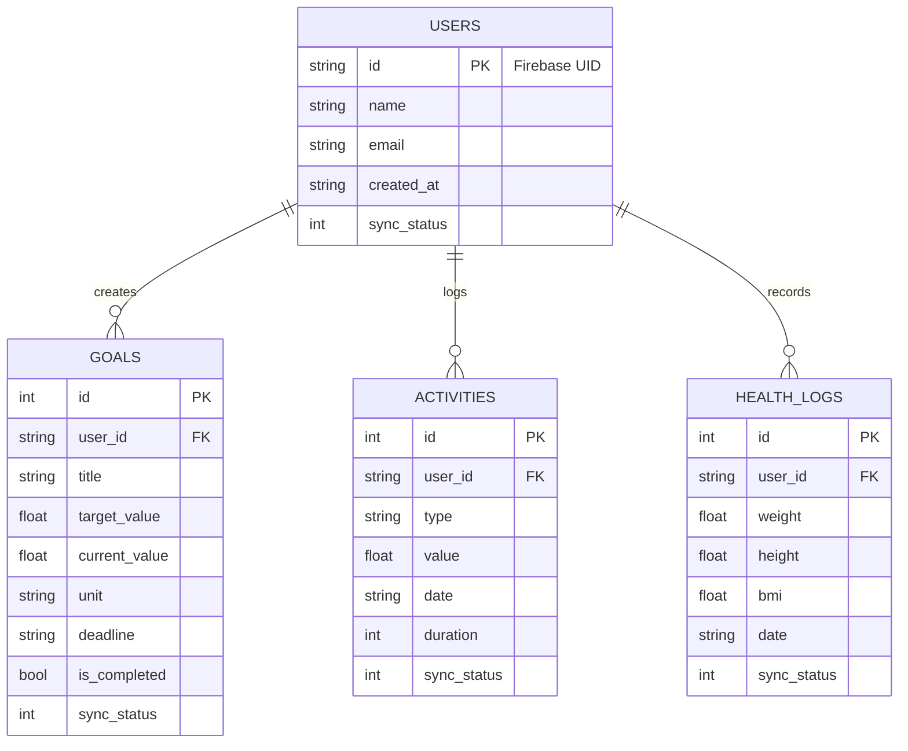

# System Architecture: Health Monitor Application
## Member 3: Data Layer & Architecture

This document outlines the technical architecture of the Integrated Digital Health Monitoring Platform, focusing on the Hybrid Data Layer, Repository Pattern, and Performance Optimization.

---

## 1. High-Level System Architecture
The application follows a **Hybrid Data Layer** architecture. SQLite serves as the primary local persistence engine (ensuring offline capability), while Firebase provides a cloud-based backup and synchronization layer.

---

## 2. Hybrid Data Synchronization Strategy
To meet the university requirements for SQLite while adding modern cloud features, we use an **Async Mirroring** strategy:

1.  **Write Path:** When data is created (e.g., a new Goal), it is written to SQLite immediately. A background task is then triggered to mirror this change to Cloud Firestore.
2.  **Read Path:** The UI always reads from SQLite to ensure zero latency and offline support.
3.  **Restoration Path:** Upon logging in on a new device, the app pulls the full dataset from Firestore and populates the local SQLite database.

---

## 3. Performance & UX Optimization: Lazy Loading
To ensure high performance and low memory consumption (Requirement #7), the architecture utilizes **Lazy Component Initialization**.

- **Architectural Decision:** Instead of static instantiation, the Data Layer uses **Lazy Getters** for cross-service communication.
- **Impact:** Reduces initial memory footprint during startup and prevents memory-leaking circular dependencies between the `SyncService` and `Repositories`.

---

## 4. Database Architecture (ERD)
The local relational database is designed with SQLite, focusing on user-centric health data tracking with cloud parity support.

---

## 5. Key Architectural Components

### A. Repository Pattern
Acts as an abstraction layer between the Business Logic and the Data Sources.
- `UserRepository`: Manages `User` profiles.
- `GoalRepository`: Handles goal CRUD and "Smart Progress" logic.
- `ActivityRepository`: Manages activity logs.

### B. Sync Service
An internal utility that monitors SQLite changes and ensures parity with Firebase Firestore. It uses `sync_status` flags in the local database to handle offline-to-online transitions.

### C. Authentication Service
Wraps `FirebaseAuth` to provide a clean interface for the UI, managing the transition between "Logged Out" and "Logged In" states while triggering the initial data rehydration.

---
**Last Updated:** 2026-04-25
**Author:** LSR Vidanaarachchi (Member 3)
