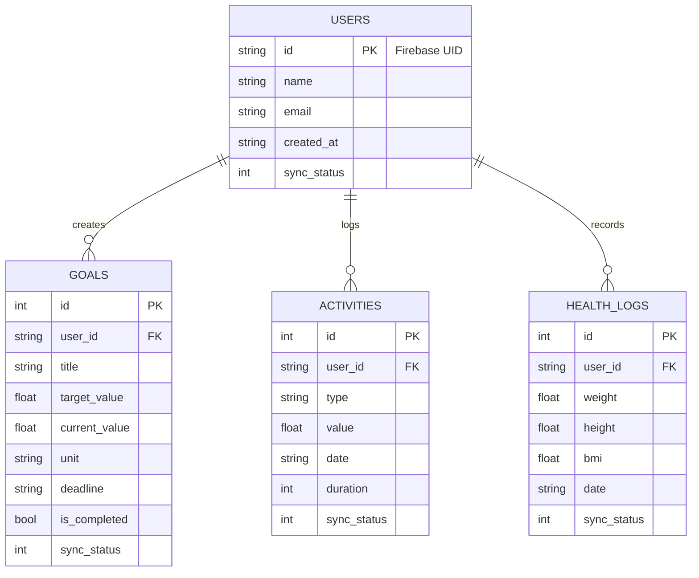

# System Architecture: Health Monitor Application
## Member 3: Data Layer & Architecture

This document outlines the technical architecture of the Integrated Digital Health Monitoring Platform, focusing on the Hybrid Data Layer, Repository Pattern, and Performance Optimization.

---

## 1. High-Level System Architecture
The application follows a **Hybrid Data Layer** architecture. SQLite serves as the primary local persistence engine (ensuring offline capability), while Firebase provides a cloud-based backup and synchronization layer.

```mermaid
graph TD
    User((User)) --> UI[Flutter UI Layer\n(Member 1 & 2)]
    UI --> VM[ViewModels / Providers]
    VM --> Repo[Repository Layer\n(Member 3)]
    
    subgraph "Data Layer (LakiDev - Member 3)"
        Repo --> SQL[(Local SQLite\nPrimary Storage)]
        Repo --> Sync[Sync Service\nBackground Task]
        Sync --> Fire[(Firebase Cloud\nBackup Storage)]
    end
    
    subgraph "Authentication"
        Repo --> Auth[Firebase Auth]
    end
```

---

## 2. Hybrid Data Synchronization Strategy (The "Zero-Code" Auto-Sync)
To meet the university requirements for SQLite while adding modern cloud features, we use an **Async Mirroring** strategy built on a unified "Map Translation" architecture. This allows SQLite and Firebase to communicate perfectly without writing complex, rigid cloud schemas.

1.  **Shared Translation Layer:** The Dart Model classes (e.g., `Goal`) contain a `.toMap()` function. This map acts as the Single Source of Truth for both databases.
2.  **Write Path:** When data is created or updated, the Repository inserts the generated `.toMap()` into SQLite immediately.
3.  **The Auto-Sync Trigger:** Simultaneously, a background task (`SyncService`) is triggered. It takes that exact same `.toMap()` output and passes it directly to Firebase using `.set()`. 
4.  **Zero-Configuration Scaling:** If Member 3 adds a new column to SQLite (like `category`), they only update the common `.toMap()` function. SQLite receives the new column, and Firebase *blindly accepts the new map key* and automatically generates a new field in the cloud without any extra Firebase-specific code.

```mermaid
graph TD
    A([User Saves Goal]) -->|Passes Object| B[GoalRepository\n(Member 3)]
    
    subgraph "The 'Zero-Code' Translation Engine"
    B -->|Calls| M[ Goal.toMap() \n Generates dynamic key-value pairs ]
    end
    
    M -->|"INSERT INTO goals..."| SQL[(SQLite DB\nStrict Schema)]
    M -->|"syncGoal( goal.toMap() )"| Sync[SyncService\nBackground Async]
    Sync -->|Auto-Generates Cloud Fields| Fire[(Firebase Firestore\nNo Schema Needed)]

    style M fill:#e1f5fe,stroke:#1565c0,stroke-width:2px,stroke-dasharray: 5 5
    style SQL fill:#ce93d8,stroke:#4a148c,stroke-width:2px
    style Fire fill:#ffcc80,stroke:#e65100,stroke-width:2px
```

## 3. Performance & UX Optimization: Lazy Loading
To ensure high performance and low memory consumption (Requirement #7), the architecture utilizes **Lazy Component Initialization**.

- **Architectural Decision:** Instead of static instantiation, the Data Layer uses **Lazy Getters** for cross-service communication.
- **Impact:** Reduces initial memory footprint during startup and prevents memory-leaking circular dependencies between the `SyncService` and `Repositories`.
- **Decoupled Firebase Sync Pattern:** To prevent stack overflow and race conditions, the Data Layer is decoupled from the Sync Layer.
    - **Trigger 1: Startup Sync (Automatic):** Triggered by `AuthService` on every login/launch to sync Firebase Cloud data to SQLite.
    - **Trigger 2: Refresh Sync (Manual):** Triggered by the user via the Dashboard's pull-to-refresh to push SQLite data to Firebase Firestore.
- **Conditional Platform Initialization:** Implemented using `dart.library.html` detection to isolate platform-specific database factories, ensuring zero compilation errors across Web and Mobile environments.

---

## 4. Database Architecture (ERD)
The local relational database is designed with SQLite, focusing on user-centric health data tracking with cloud parity support.



---

## 5. Key Architectural Components

### A. Repository Pattern
Acts as an abstraction layer between the Business Logic and the Data Sources.
- `UserRepository`: Manages `User` profiles.
- `GoalRepository`: Handles goal CRUD and "Smart Progress" logic.
- `ActivityRepository`: Manages activity logs.

### B. Sync Service
An internal utility that monitors SQLite changes and ensures parity with Firebase Firestore. It uses `sync_status` flags in the local database to handle offline-to-online transitions.

### C. Authentication Service
Wraps `FirebaseAuth` to provide a clean interface for the UI, managing the transition between "Logged Out" and "Logged In" states while triggering the initial data rehydration.

---
**Last Updated:** 2026-04-25
**Author:** LSR Vidanaarachchi (Member 3)
